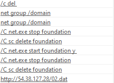
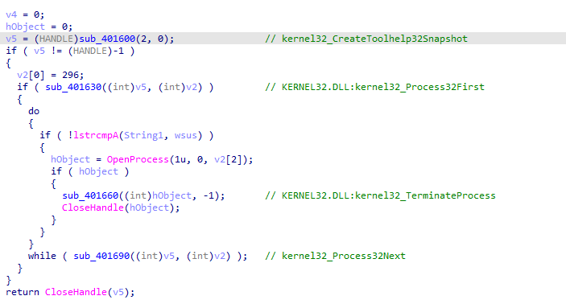
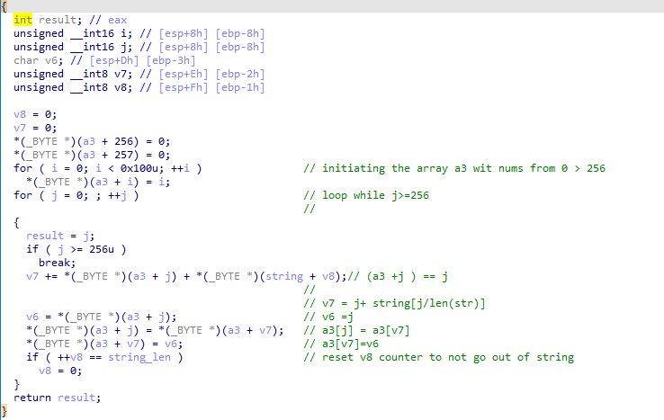
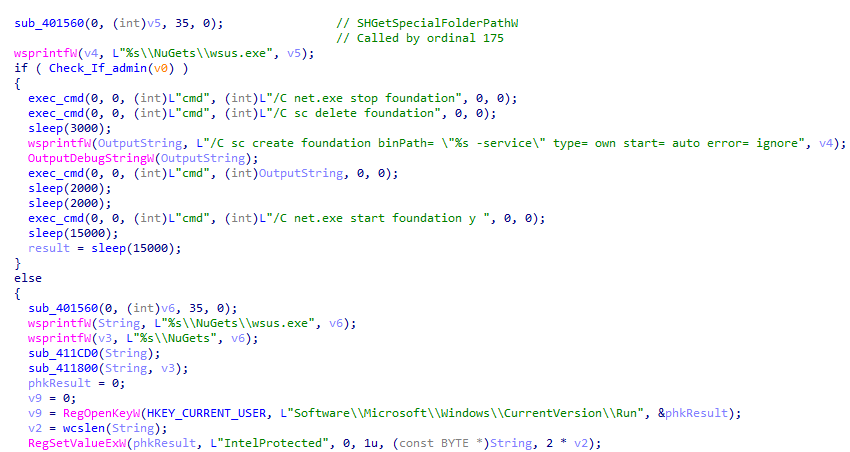

**Sample 2 report**

**Document info**

**Sample Name: Sample2**

**Author: Abdelrahman Eldawi**

**Description: Trojan downloader**

**Attachments: Unpacked sample, Removal scripts**

[]{#_Toc80190130 .anchor}**Sample Information**

**SHA256
CB114123CA1C33071CF6241C3E5054A39B6F735D374491DA0B33DFDAA1F7EA22**

**MD5 B635C11EFDF4DC2119FA002F73A9DF7B**

**Sample Type Windows Exe (x86-32)**

[]{#_Toc80132801 .anchor}**Executive Summary**

**This malware is just a downloader for the actual encrypted malware to
evade detection, it decrypts then executes it, also it enforces some
persistence techniques according to the running environment to make sure
that the malware would still be there in victim's machine**

# Initial assessment

At Malware initial assessment using **Pestudio** and **DIE (Detect it
easy),** it was found that the sample is **Windows Exe (x86-32)** and it
has **(Microsoft Visual C/C++(6.0))** compiler stamp

{width="5.628788276465442in"
height="2.626768372703412in"}

By analyzing the entropy of file sections, it looks like there is
appended part on the exe (**Overlay)** that is packed and indirectly
loaded after the malware is executed

{width="6.5in"
height="4.486111111111111in"}

## Unpacking

To unpack the file, I used **Unpac.me** online service and it was able
to extract the unpacked child

{width="6.5in"
height="2.092361111111111in"}

**Unpacked Sample basic information**

MD5 :71b183a44f755ca170fc2e29b05b64d5

SHA1: 67fc3717e0ea134599633e1e7e8daf6cc0857f99

## Imports

{width="6.34375in"
height="4.895833333333333in"}

We can find lots of interesting API calls which is able to **manipulate
Registry**, **Files** & **Execute processes ... etc**

## Strings

If we examine the strings of malware, we can identify a lot of malicious
strings that give us information about the behavior of the malware and
what it tries to do on a system.

{width="5.145833333333333in"
height="2.375in"}{width="2.3958333333333335in"
height="1.7395833333333333in"}

These strings are combination of CMD commands, URL, System Paths, Files.

Cmd commands are used to query domain controller and manipulate windows
services.

URL is for a file to be downloaded apparently

And some interested paths and files

# Dynamic analysis using sandbox

Using **any.run** service it was found that the malware is querying the
domain controller for the machine, then it deletes itself.

{width="4.757575459317585in"
height="2.4052187226596677in"}

Looking at HTTP requests, it tried to download a file but the server
didn't respond, so this clarifies why it deleted itself from the system
at the first place

{width="6.5in"
height="1.2090277777777778in"}

# Analysis part

\*All functions were renamed by me to easy explanations

{width="6.5in"
height="3.526388888888889in"} The first variable v18 is calling a
function to get the Major & Minor version of the windows in order to
identify the windows version

The next 2 functions (**EraseTape** which is used to erase Tape storage,
**GetPrinterA** retrieves information about a specified printer), They
were put there for no reason cause 0 is passed in handle argument which
is invalid handle for Tape or Printer. So, we can say that they were put
as a distraction.

Then the if condition (**sub_411260**) it executes (**net group
/domain**)\* to check the domain name you are inside and check whether
it's WORKGROUP and returns true if it is, but this if condition is
**always** **TRUE** because the OR condition with both return and the
compliment, one of them will be TRUE

\*<https://attack.mitre.org/techniques/T1087/>

## Delete_wsus_exe function

{width="4.875in"
height="2.1666666666666665in"}

At first it executes (**SHGetSpecialFolderPathA**) it retrieves the path
of a special folder, identified by its CSIDL, 0x23 CSIDL refers to
**CSIDL_COMMON_APPDATA** which is the file system directory containing
application data for all users. Aka (**C:\\ProgramData**) it appends it
then to both paths shown on image above

And then delete the wsus.exe file, this behavior is associated with
removing previous versions or instances of the malware if it was already
running.

**Check_If_Admin function: -**

**This function wasn't called directly, But it was dynamically resolved
and this how it looked like**

{width="2.9583333333333335in"
height="0.8229166666666666in"}

**After tracing inside this function**

{width="4.520833333333333in"
height="1.09375in"}

By setting a breakpoint on the return of the **(sub_401540)** and
checking the return value we can find that

{width="4.427083333333333in"
height="0.8333333333333334in"}

It loaded Shell32_IsUserAnAdmin

Then it checks whether the malware was executed with an admin privilege

## Terminate process function

{width="6.5in"
height="3.448611111111111in"}

As it appears it takes a snapshot of processes already running and loop
on them till it find "wsus.exe", If so, it would terminate it

The three subroutines were resolved using the same method explained
before

Then it tries to delete it once more

## 

## exec_cmd function

<https://attack.mitre.org/techniques/T1059/003/>

This function executes a CMD commands and this one was resolved for
**shell32_ShellExecuteW** and by running this as CMD command "**net.exe
stop foundation**" it stops "**foundation"** service and then it deletes
it using "**sc delete foundation**"

Once more it terminates "wsus.exe" if it's running.

It creates then "**C:\\ProgramData\\Nugets**"

Then it resolves the "**user32_wsprintfA"** by loading the library first
then the function and setting it to a pointer variable.

Then it uses **CoCreateGuid** to create a unique identifier for the
victim

Then it deletes the file **"C:\\**
**ProgramData\\Nuggets\\template\_??.TMPTMPZIP7"** for the purpose of
old instances cleaning ***\*\*?? refers to the (guid.Part3 + guid.Part1
\* guid.Part2)\*\****

Let's continue with the code

{width="6.100528215223097in"
height="2.900251531058618in"}

As we can see **file_downloader_write** is called and it's the function
responsible for downloading the malware, The reference passed to this
function as **highlighted is the reference for the URL**
[**http://54.38.127.28/02.dat**](http://54.38.127.28/02.dat)

## file_downloader_write 

{width="6.5in"
height="3.4458333333333333in"}

{width="4.727272528433946in"
height="1.0634426946631672in"}

It loads the lib "**wininet.dll**" then "**InternetReadFile ,
InternetOpenA, InternetOpenUrlA"** functions were resolved also to visit
**<http://54.38.127.28/02.dat> and download it to "C:\\**
**ProgramData\\Nuggets\\template\_??.TMPTMPZIP7"**

I looked at **Shodan** to check whether there is any information about
this IP address but it seems negative

So, at this time I needed to emulate the download server, instead of
using FakeNet I have setup a **loopback adapter** to redirect that
specific IP to localhost and configured it's Ip to **54.38.127.28**,
Then I used Python **SimpleHTTPServer** to serve the file.

python -m SimpleHTTPServer 80

{width="3.0694444444444446in"
height="3.0555555555555554in"}

Then the file was opened and handle was passed to "**hfile**"

Then it reads the file content and pass a point to "**lpbuffer**"

It then checks if the file size is more than **4Kb** , is so delete the
existed "**wsus.exe**"

## Decrypt_File function

The file downloaded was encrypted to be able to evade antiviruses
catching it in the way, So it decrypts it in house to be able to use it

The decryption key used in the function is "Porow2uj548423"

{width="6.5in" height="1.5375in"}

### 

### 

### 

### 

### 

### 

### 

### 

### 

### 

### 

### 

### 

### 

### 

### Create the decoding array function

{width="6.4947845581802275in"
height="3.5984853455818024in"}

Then how is this working?

At first it creates an array of length **256** and initiate it with
numbers from \[**0>255**\] in sequence

a\[0\] = 0 , a\[1\] = 1 ...... therefore **a\[j\] = j** until it loops
256 timesx

v7 += j + dec_key\[v8\]

v6 =j

a\[j\] = a\[v7\]

a\[v7\]=v6=j therefore a\[v7\] = j

The variable **v8** keeps increasing till it reaches the (**secret
key**) length then it's set to 0 again, after it ends, the decoding
matrix constructed from the word should be like the illustration below

{width="5.037878390201225in"
height="1.8287018810148732in"}

### Decryption function

As we can see the length of this array is 256 so in the second function
which makes the actual decryption extends the usage & edits it to the
file length to fit, so the current 2 factors affecting the actual
encryption XOR key is **Downloaded file length** & **the initial word
passed into the first function**

**Sub_4126E0**

{width="6.5in"
height="2.435416666666667in"}

**v5, v6 , v7 are int8 so their max num is 256 then it overflows and
start from beginning**

At first variable **v6, v7** are initiated with value **0,** the
decryption algorithm loop till it reaches the end of the downloaded
file, noting that variable **v7** is increased by one every iteration,
simplified pseudo code is shown downside for more illustration

V6+= decoding_arr\[v7\]

V5 = decoding_arr\[v7\]

decoding_arr\[v7\] = decoding_arr\[v6\]

decoding_arr\[v6\] = v5 **= decoding_arr\[v7\]**

**EncryptedFile\[i\] Xor
decoding_arr\[decoding_arr\[v6\]+decoding_array\[v7\]\]**

## Returning back to main function analysis

{width="6.5in"
height="3.472916666666667in"}

Then it checks whether the decryption was done correctly or not by
checking the magic bytes "**MZ**" on the decrypted file buffer then
checks for admin privileges

if **it's not admin**

-   it will open the file "**wsus.exe**" and then delete **"C:\\**
    **ProgramData\\Nuggets\\template\_??.TMPTMPZIP7"** file

-   **Then** deletes the file which is executing

If it has admin privilege then it will continue to the next function.

## Persistence function

{width="6.5in" height="3.45625in"}

{width="6.5in"
height="0.6048611111111111in"}

At first it resolves "**SHGetSpecialFolderPathW**" api using its ordinal
number **175.**

-   If the process was opened by **admin privileges**, then it will use
    **service persistence technique**

constructs the previous "**wsus.exe**" path like before. And it stops
and deletes "**foundation**" service, and then it creates a service with
the same name and configure it to be started automatically when widows
start

<https://attack.mitre.org/techniques/T1543/003/>

-   If the process doesn't have that privilege, then it will **add
    wsus.exe to auto startup registry**

> Create a registry value in
> "**HKCU\\Software\\Microsoft\\windows\\CurrentVersion\\Run**" which
> makes the files auto executed on the startup

The entry name will be IntelProtected

<https://attack.mitre.org/techniques/T1547/001/>

Then the running file is deleting itself and it ends :)

# Indicator of compromises

## **Hashes**

1.  Sample2.exe\
    MD5:B635C11EFDF4DC2119FA002F73A9DF7B\
    SHA1:C35A4DF038B20B9DC3FF14116325B2E36B722F6C

2.  Sample2_unpacked.exe

MD5:71B183A44F755CA170FC2E29B05B64D5

> SHA1:67FC3717E0EA134599633E1E7E8DAF6CC0857F99

## **Files**

1.  C:\\ ProgramData\\Nuggets\\template\_??.TMPTMPZIP7

2.  C:\\ ProgramData\\Nuggets\\wsus.exe

> ?? refers to the (guid.Part3 + guid.Part1 \* guid.Part2)

## **URL**

1.  <http://54.38.127.28/02.dat>

## **Startup Registry**

1.  **Path** : HKCU\\Software\\Microsoft\\windows\\CurrentVersion\\Run\\

**Name** : IntelProtected

**Value** : C:\\ProgramData\\wsus.exe

## **Services**

1.  **Foundation** service, **auto executes** this file on startup
    C:\\ProgramData\\NuGets\\wsus.exe

**\
**

# Methodology

1.  Checking the sample type either it's an executable or not

2.  If it appears to be an executable, Initial malware assessment begin

3.  Checking **sections**, **imports**, **strings**, **entropy** to get
    some knowledge about the malware (Functions they use, any meaningful
    strings, packed or not .... Etc.) using **PEStudio**, **DIE** and
    **PEID**.

4.  If it's packed, we will go through process of automated or manual
    unpacking

5.  Using sandboxes to run the malware such as **Any.Run** to be able to
    gain extra knowledge about its behavior, different tests should be
    applied under **different conditions** (Admin privileges, different
    OS, Waiting additional time ...etc.)

6.  Scanning via **VirusTotal** is an important step to check the
    feedback of various antiviruses about this malware also the
    community comments

7.  Static & Dynamic Analysis using proper tools, in this case
    **IdaPro** can be used as **debugger** & **disassembler**, **Process
    Monitor** to keep track of malware behavior by tracking **API
    calls** and various operations, **Process explorer** to check
    **process hierarchy**, **hooked modules, Strings in memory** and
    **TCP/IP** connections.

8.  Extracting **IOCs**
